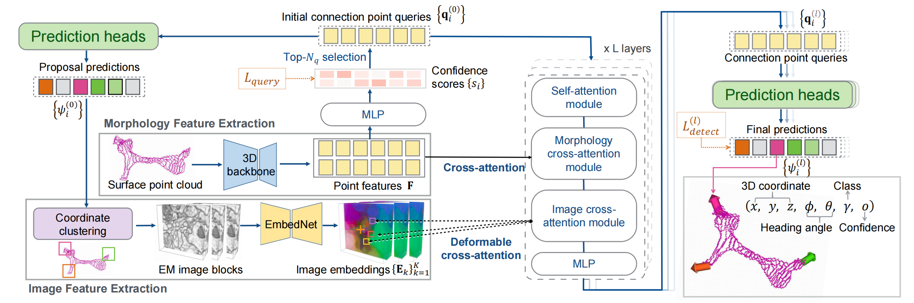

# Neuron Segment Connectivity Prediction with Multimodal Features for Connectomics

This repository contains the official implementation for the paper "Neuron Segment Connectivity Prediction with Multimodal Features for Connectomics".

## TODO
- [x] Test code
      
Upon the paper's acceptance:
- [ ] Training code
- [ ] Scripts to extract data from neuron skeletons (SWC files)
- [ ] 


### Abstract

Reconstructing neurons from large electron microscopy (EM) datasets for connectomic analysis presents a significant challenge, particularly in segmenting neurons of complex morphologies. Previous deep learning-based neuron segmentation methods often rely on pixel-level image context and produce extensive over-segmented fragments. Detecting these split errors and merging the split neuron segments are non-trivial for various neurons in a large-scale EM data volume. In this work, we exploit multimodal features in the full workflow of automatic neuron proofreading. We propose a novel connection point detection network that utilizes both global 3D morphological features and high-resolution local image context to extract candidate segment pairs from massive adjacent segments. To effectively fuse the 3D morphological feature and the dense image features from very different scales, we design a proposal-based image feature sampling to improve the efficiency of multimodal cross-attentions. Integrating the connection point detection network with our connectivity prediction network which also utilizes multimodal features, we make a fully automatic neuron segment merging pipeline, closely imitating human proofreading. Comprehensive experimental results verify the effectiveness of the proposed modules and demonstrate the robustness of the entire pipeline in large-scale neuron reconstruction.

## 2. Downloads

-   **[Models and Datasets (Google Drive)](https://drive.google.com/drive/folders/1q8tjm7fJRqZuv_rV-4gVO7A7GBmhw9bb?usp=sharing)**

## 3. Environment Setup

```bash
bash init_ptv3.sh
```

> #### **Note for PointNet++**
>
> The version using **PointNet++** as its backbone requires additional compilation, detailed in the comments within the init_ptv3.sh file.

## 4. Testing

We provide separate testing scripts for the two different backbones used in our paper.

### PTv3 Version

To run the test with the **PTv3** backbone, execute the following command:

```bash
bash test_vector_image_ptv3.sh
```

### PointNet++ Version

To run the test with the **PointNet++** backbone, execute the following command:

```bash
bash test_vector_image.sh
```

